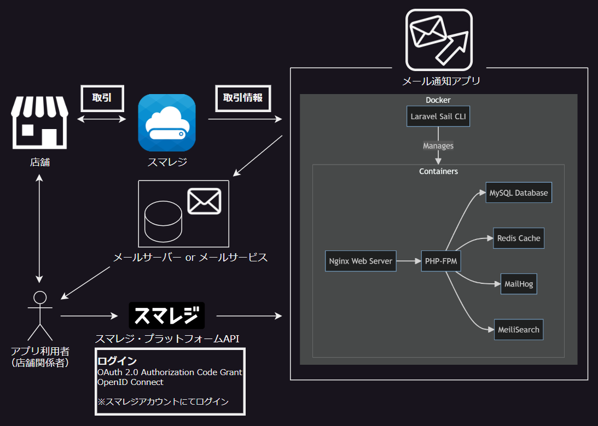
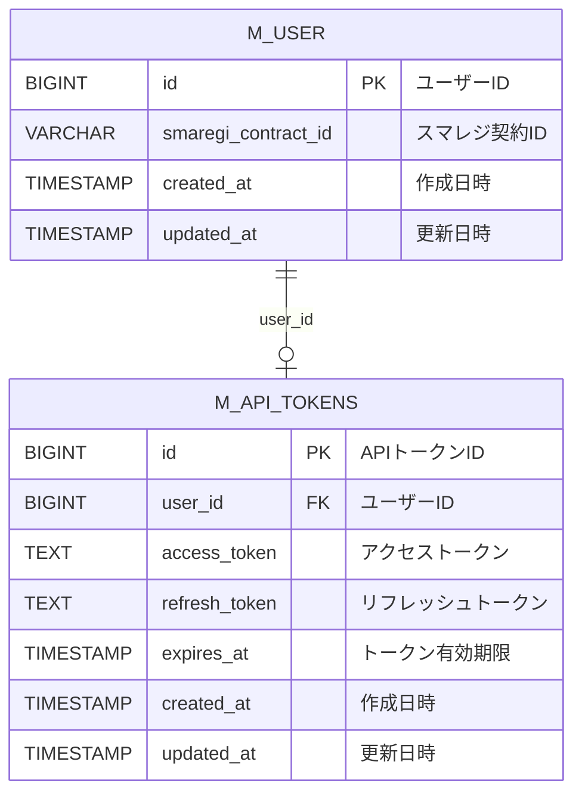

# メール通知アプリ

## 概要

### 1.システム概要
本アプリでは、スマレジ（クラウドPOSレジ）の取引情報を取得し、<br>
特定の商品が販売された場合に、利用者にメールで通知をするアプリである<br>



### 2.環境構築

#### 環境
**バックエンド**<br>
　Laravel 11（Laravel Sail, Vite）<br>
　MySQL 8<br>

**フロントエンド**<br>
　React 18<br>
　Sass<br>
　TypeScript<br>

#### 手順
下記の記事を参考に環境構築を実施<br>
　[Laravel Sail を活用した Laravel 10 と React 18 の SPA 開発環境の構築手順](https://ryamate.hatenablog.com/entry/laravel_sail_react)<br>
　[Laravel × React + TypeScript で SPA の開発環境を構築（Laravel Sail を利用）](https://qiita.com/shikuno_dev/items/7e679b2fdf0bb92cb2b0)<br>
　[Laravelまとめその1 Laravel Sailで11および10環境を構築しよう編](https://qiita.com/motuneko253/items/4ca503b2a2beba5fa232)<br>
　　※現在（2024/08時点）でインストールコマンドを実行すると`Laravel11`がインストールされる<br>

#### 補足
**1.[スマレジDevelopers](https://developers.smaregi.jp/signup/)へ登録**<br>
　→登録完了後、アプリを登録する<br>
　→アプリ登録完了後、環境設定からクライアントIDとクライアントシークレットを確認し、<br>
　　`.env`の`SMAREGI_CLIENT_ID`と`SMAREGI_CLIENT_SECRET`を自身のものに書き換える<br>

**2.[ngrok](https://ngrok.com/)へ登録**<br>
　→スマレジ・プラットフォームAPIからWebhookを受け取る必要があり、ローカル環境にて動作確認をするために必要<br>
　→登録完了後、[こちらの記事](https://dev.to/naxrohan/laravel-sail-ngrok-2kk4)を参考に、<br>
　　`.env`の`APP_URL`にngrokのURL（パブリックURL）及び`.env`の`NGROK_AUTHTOKEN`に自身の認証トークンを記載をする<br>
　　（`docker-compose.yml`への記載は対応済み）<br>
　※ngrokのURL（パブリックURL）は起動ごとに毎回変わるため、都度変更が必要<br>
　　また、スマレジDevelopersのアプリのURLなども同様に変更が必要<br>
　　（他に良いやり方がないか検討中）<br>

**3.[mailtrap](https://mailtrap.io/)へ登録**<br>
　→ローカル環境にてメール送信の動作確認をするために、開発者向けのテスト用メールサーバーサービスを使用<br>
　→登録完了後、[こちらの記事](https://reffect.co.jp/laravel/mailtrap-dummy-smtp-server#google_vignette)を参考に、`.env`の該当箇所を自身のものに書き換える<br>

**4.マイグレーションの実行**<br>
- **sailコマンドを実行する前は下記コマンドを実行する**<br>
    ```bash
    alias sail='[ -f sail ] && bash sail || bash vendor/bin/sail'
    ```
- **Laravel Sailを起動する**<br>
    ```bash
    sail up -d
    ```
- **マイグレーションファイルを実行し、データベースに反映させる**<br>
    ```bash
    # マイグレーション時やロールバック時はLaravelが自動的に依存関係を考慮して正しい順序で実行してくれる

    # マイグレーション実行
    # マイグレーションファイルのupメソッドを実行し、データベースに新しいテーブルやカラムが作成される
    sail artisan migrate

    # ロールバック実行（上記で行ったマイグレーションを戻したい場合のみ実施する）
    # マイグレーションファイルのdownメソッドを実行し、元の状態に戻す
    sail artisan migrate:rollback
    ```

**5.アプリの実行**<br>
- **sailコマンドを実行する前は下記コマンドを実行する**<br>
    ```bash
    alias sail='[ -f sail ] && bash sail || bash vendor/bin/sail'
    ```
- **Laravel Sailを起動する**<br>
    ```bash
    sail up -d
    ```
- **Viteの開発サーバーを起動する**<br>
    ```bash
    sail npm run dev
    ```
    上記のコマンドを実行後、`APP_URL`にアクセスをするとアプリが起動する

### 3.テーブル設計

#### テーブル定義
**1. `m_user` テーブル（`ユーザーマスタ`テーブル）**

**役割**: 通知メールを受け取るユーザー情報を格納します。

```sql
CREATE TABLE m_user (
    id BIGINT UNSIGNED AUTO_INCREMENT PRIMARY KEY COMMENT 'ユーザーID',
    smaregi_contract_id VARCHAR(255) UNIQUE NOT NULL COMMENT 'スマレジ契約ID',
    created_at TIMESTAMP DEFAULT CURRENT_TIMESTAMP COMMENT '作成日時',
    updated_at TIMESTAMP DEFAULT CURRENT_TIMESTAMP ON UPDATE CURRENT_TIMESTAMP COMMENT '更新日時',
) COMMENT = 'ユーザーマスタ';
```

| 論理名                 | 物理名                | データ型       | PK/FK | 必須  | デフォルト                        |
|------------------------|-----------------------|----------------|-------|-------|-----------------------------------|
| ユーザーID             | id                    | BIGINT        | PK    | YES   | AUTO_INCREMENT                   |
| スマレジ契約ID         | smaregi_contract_id   | VARCHAR(255)   |       | YES   | NULL                              |
| 作成日時               | created_at            | TIMESTAMP      |       | NO    | CURRENT_TIMESTAMP                |
| 更新日時               | updated_at            | TIMESTAMP      |       | NO    | CURRENT_TIMESTAMP ON UPDATE      |

**2. `m_api_tokens` テーブル（`APIトークンマスタ`テーブル）**

**役割**: API通信で使用するアクセストークンとリフレッシュトークンを格納します。

```sql
CREATE TABLE m_api_tokens (
    id BIGINT UNSIGNED AUTO_INCREMENT PRIMARY KEY COMMENT 'APIトークンID',
    user_id BIGINT UNSIGNED UNIQUE COMMENT 'ユーザーID', -- m_userテーブルへの外部キー（1ユーザーに対して1つのトークンが関連付く仕様）
    access_token TEXT NOT NULL COMMENT 'アクセストークン',
    refresh_token TEXT NOT NULL COMMENT 'リフレッシュトークン',
    expires_at TIMESTAMP NOT NULL COMMENT 'トークン有効期限',
    created_at TIMESTAMP DEFAULT CURRENT_TIMESTAMP COMMENT '作成日時',
    updated_at TIMESTAMP DEFAULT CURRENT_TIMESTAMP ON UPDATE CURRENT_TIMESTAMP COMMENT '更新日時'
    FOREIGN KEY (user_id) REFERENCES m_user(id) ON DELETE CASCADE
) COMMENT = 'APIトークンマスタ';
```

| 論理名                 | 物理名                | データ型       | PK/FK | 必須  | デフォルト                        |
|------------------------|-----------------------|----------------|-------|-------|-----------------------------------|
| APIトークンID          | id                    | BIGINT        | PK    | YES   | AUTO_INCREMENT                   |
| ユーザーID             | user_id               | BIGINT        | FK    | YES   | NULL                              |
| アクセストークン       | access_token          | TEXT   |       | YES   | NULL                              |
| リフレッシュトークン   | refresh_token         | TEXT   |       | YES   | NULL                              |
| トークン有効期限       | expires_at            | TIMESTAMP      |       | YES   | NULL                              |
| 作成日時               | created_at            | TIMESTAMP      |       | NO    | CURRENT_TIMESTAMP                |
| 更新日時               | updated_at            | TIMESTAMP      |       | NO    | CURRENT_TIMESTAMP ON UPDATE      |

※アクセストークンとリフレッシュトークンに関しては、テーブル登録時に暗号化を実施する<br>
　Laravelの暗号化機能を使用する<br>
　　→「Crypt::encryptString()」を使ってトークンを暗号化、「Crypt::decryptString()」を使って暗号化されたトークンを複合化<br>
※アクセストークンの使い回しに関しては、[こちらの記事](https://community.smaregi.dev/discussion/81/%E3%82%A2%E3%82%AF%E3%82%BB%E3%82%B9%E3%83%88%E3%83%BC%E3%82%AF%E3%83%B3%E3%81%AE%E4%BD%BF%E3%81%84%E3%81%BE%E3%82%8F%E3%81%97)を参考に、下記の流れで考えている<br>
　*************************<br>
　①アクセストークン取得<br>
　②期間内であれば、そのままトークンを使用<br>
　③期間外になればリフレッシュトークンを利用してアクセストークンを再発行し使用<br>
　　※この際、再発行時に取得したリフレッシュトークン・アクセストークン・トークン有効期限にてDBを更新する<br>
　　※「リフレッシュトークンの有効期限は発行から30日間」かつ「本アプリの場合、ユーザーが定期的にアプリにログインするのは少ないと思われる」ため、<br>
　　　バッチ実行などで定期的にトークンの再発行を行う予定<br>
　*************************<br>

#### ER図



### 4.外部ツールの使用

#### A5:SQL Mk-2

**1. `.env`の設定変更**<br>

`.env`の`DB_HOST`を `localhost` に変更する<br>
設定変更後は念のため再起動する<br>
```bash
sail down
sail up -d
```

**2. 外部ツール（A5:SQL Mk-2）からの接続設定**<br>

A5:SQL Mk-2 などの外部ツールで接続設定を行う<br>

- **ホスト名**: `localhost`
- **ポート**: `3306`
- **ユーザー名**: `.env` の`DB_USERNAME`
- **パスワード**: `.env` の`DB_PASSWORD`
- **データベース**: `.env` の`DB_DATABASE`
